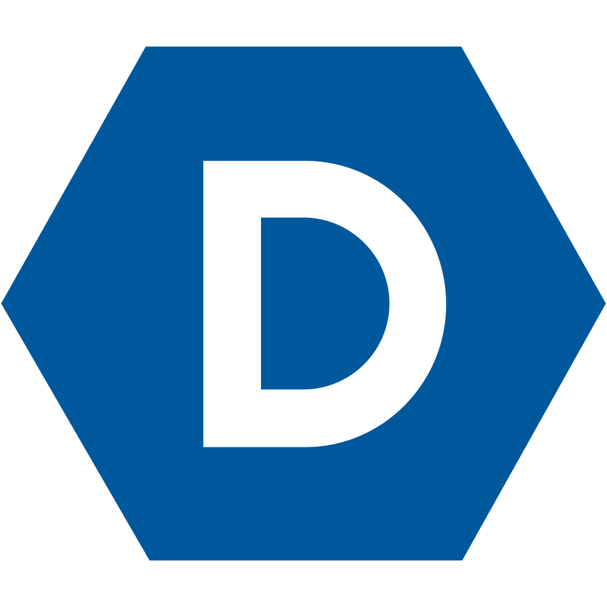

  

<h1 align="center" style="margin-top: -8vh;">
  Hi there, I'm <a href="https://shubhthorat.vercel.app/" target="_blank">Shubh Thorat</a>
  
</h1>

<h5 align="center">

<a href="https://www.github.com/itsjustshubh" target="_blank" title="Github" style="margin: 0 10px;">
            <code></code>
        </a><a href="https://www.hackerrank.com/shubhcthorat" target="_blank" title="HackerRank" style="margin: 0 10px;">
            <code></code>
        </a><a href="https://www.linkedin.com/in/shubhthorat/" target="_blank" title="Linkedin" style="margin: 0 10px;">
            <code></code>
        </a><a href="https://www.instagram.com/_itsjustshubh/" target="_blank" title="Instagram" style="margin: 0 10px;">
            <code></code>
        </a><a href="mailto:reapers-arras.0y@icloud.com" target="_blank" title="iCloud Mail" style="margin: 0 10px;">
            <code></code>
        </a><a href="https://devpost.com/software/edith-brshpa" target="_blank" title="Devpost" style="margin: 0 10px;">
            <code></code>
        </a>

</h5>

Hi there! 👋 I'm **Shubh Thorat**, an aspiring computer scientist, innovator, and the founder of Social Cloud. Currently pursuing my BS in Computer Science at Northeastern University, I'm passionate about leveraging technology for social good. I thrive on challenges and constantly set goals for myself, so I have something to strive toward. I'm not comfortable with settling, and I'm always looking for an opportunity to do better and achieve greatness. 🚀

🔗 **Let's connect!** Feel free to reach out if you want to collaborate on tech projects or just have a chat about innovative ideas in tech. Check out my [LinkedIn](https://www.linkedin.com/in/shubhthorat/) or visit my [portfolio website](https://shubhthorat.vercel.app) for more details about my work.

## Skills

<a href="https://www.python.org/" target="_blank" title="Python" style="margin: 0 10px;"><code></code></a> <a href="https://www.java.com/en/" target="_blank" title="Java" style="margin: 0 10px;"><code></code></a> <a href="#" target="_blank" title="Git" style="margin: 0 10px;"><code></code></a> <a href="#" target="_blank" title="React" style="margin: 0 10px;"><code></code></a> <a href="#" target="_blank" title="JavaScript" style="margin: 0 10px;"><code></code></a> <a href="#" target="_blank" title="Node.js" style="margin: 0 10px;"><code></code></a> <a href="#" target="_blank" title="HTML5" style="margin: 0 10px;"><code></code></a> <a href="#" target="_blank" title="AWS" style="margin: 0 10px;"><code></code></a>

## 📚 Education

Education

<h2>📚 Education</h2>

<h2>📚 Education</h2>

<h2>📚 Education</h2>

<h2>📚 Education</h2>

<h2>📚 Education</h2>

<h2>📚 Education</h2>

<h2>📚 Education</h2>

---

## 🏅 Projects

Projects

Project Loading Screen

- **Timeline:** Jan 2023 - Present
- **Description:** 'Project Loading Screen' is an inventive display of the iconic Apple and Windows loading screens, refined to perfection. This project, developed by Shubh Thorat, presents these familiar visuals in a perpetual loop, turning a simple concept into an intriguing endless experience.

Designed to showcase exceptional React skills, this project playfully explores the boundaries of user patience and perception. It’s an artistic interpretation of the endless wait, offering a polished, mesmerizing version of the screens we often encounter but rarely appreciate. Enjoy this endless journey through the most iconic loading screens, crafted to captivate and amuse.

A Will To Live (AWTL)

- **Timeline:** Oct 2020 - Dec 2021
- **Description:** AWTL, a project close to my heart, focuses on aiding individuals battling mental health challenges. The initiative provides resources and support, fostering a community where everyone feels empowered to seek the help they need.

My role as President of Technology and Logistics involved spearheading the website development, strategizing marketing approaches, and partnering with social influencers to promote wellness.

Social Cloud

- **Timeline:** Aug 2020 - Dec 2021
- **Description:** Social Cloud is an innovative platform where business ideas meet big data for a noble cause – supporting NGOs and Charities. I was part of an enthusiastic student team that built this unique agency, specializing in customized social marketing.

Our efforts aimed to harness the power of digital platforms to create positive global impact.

Graphic Design

- **Timeline:** Feb 2020 - Present
- **Description:** My journey in Graphic Design began with a keen interest in video production and typography. I focus on creating instructional tech videos, aiming to bridge the technology gap for seniors.

My work, which began with assisting the older generation in technology adoption, has now expanded to collaborating on diverse multimedia projects.

Edith (An AI Calendar App)

- **Timeline:** Oct 2023 - Present
- **Description:** Edith redefines planning in the digital age, seamlessly integrating life's many facets into a single, intuitive planner. More than just a scheduling tool, Edith offers academic planning, mood-based music suggestions, astrological insights, and activity planning based on weather forecasts.

This project, developed using agile methodologies and diverse APIs, stands out by prioritizing holistic well-being in daily organization.

---

## 🚀 About Me
<!-- DYNAMIC_ABOUT -->

---

## 📈 My GitHub Stats

---

## 🏅 Achievements & Contributions

<!-- DYNAMIC_ACHIEVEMENTS -->

---

## 📚 Continuous Learning

<!-- DYNAMIC_LEARNING -->

---

## 🔗 Let's Connect!

<!-- DYNAMIC_CONNECT -->

---

### 💫 Extra

<!-- DYNAMIC_EXTRA -->

