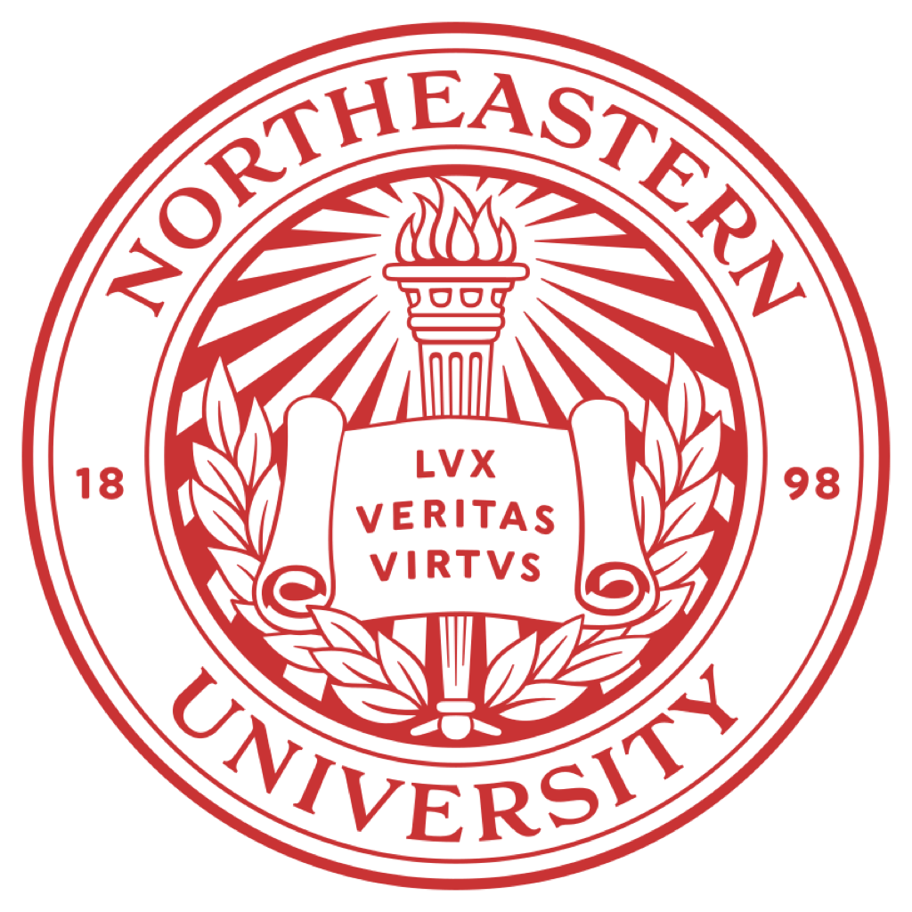
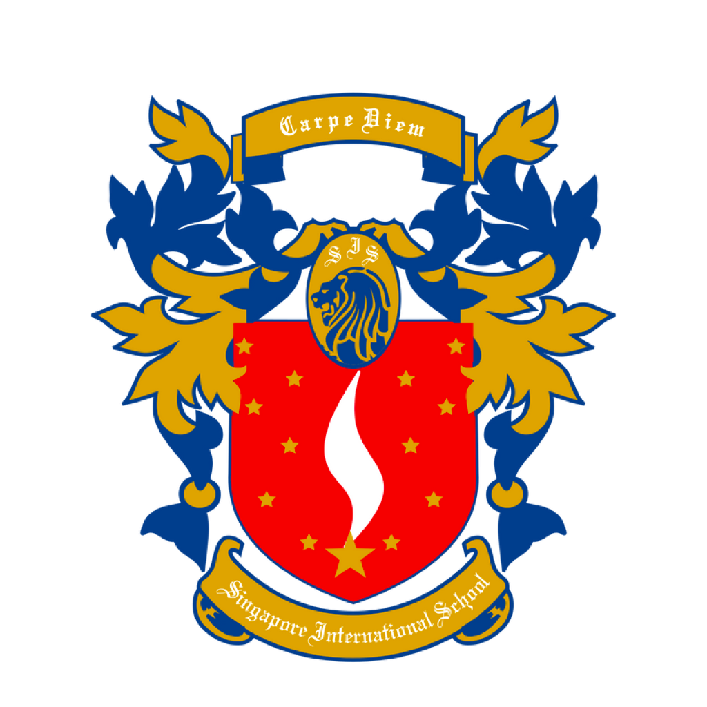
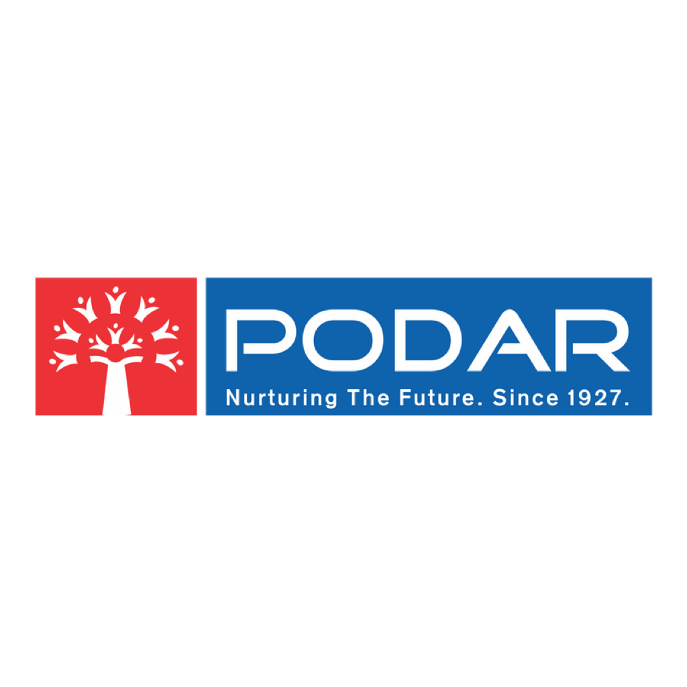

  

<h1 align="center" style="margin-top: -8vh;">
  Hi there, I'm <a href="https://shubhthorat.vercel.app/" target="_blank">Shubh Thorat</a>
  
</h1>

<h5 align="center">

<a href="https://www.github.com/itsjustshubh" target="_blank" title="Github" style="margin: 0 10px;">
            <code></code>
        </a><a href="https://www.hackerrank.com/shubhcthorat" target="_blank" title="HackerRank" style="margin: 0 10px;">
            <code></code>
        </a><a href="https://leetcode.com/itsjustshubh/" target="_blank" title="LeetCode" style="margin: 0 10px;">
            <code></code>
        </a><a href="https://www.linkedin.com/in/shubhthorat/" target="_blank" title="Linkedin" style="margin: 0 10px;">
            <code></code>
        </a><a href="mailto:reapers-arras.0y@icloud.com" target="_blank" title="iCloud Mail" style="margin: 0 10px;">
            <code></code>
        </a><a href="https://devpost.com/itsjustshubh" target="_blank" title="Devpost" style="margin: 0 10px;">
            <code></code>
        </a>

</h5>

Hi there! 👋 I'm **Shubh Thorat**, an aspiring computer scientist, innovator, and the founder of Social Cloud. Currently pursuing my BS in Computer Science at Northeastern University, I'm passionate about leveraging technology for social good. I thrive on challenges and constantly set goals for myself, so I have something to strive toward. I'm not comfortable with settling, and I'm always looking for an opportunity to do better and achieve greatness. 🚀

🔗 **Let's connect!** Feel free to reach out if you want to collaborate on tech projects or just have a chat about innovative ideas in tech. Check out my [LinkedIn](https://www.linkedin.com/in/shubhthorat/) or visit my [portfolio website](https://shubhthorat.vercel.app) for more details about my work.

## Skills

<a href="https://www.python.org/" target="_blank" title="Python" style="margin: 0 10px;"><code></code></a> <a href="https://www.java.com/en/" target="_blank" title="Java" style="margin: 0 10px;"><code></code></a> <a href="#" target="_blank" title="Git" style="margin: 0 10px;"><code></code></a> <a href="#" target="_blank" title="React" style="margin: 0 10px;"><code></code></a> <a href="#" target="_blank" title="JavaScript" style="margin: 0 10px;"><code></code></a> <a href="#" target="_blank" title="Node.js" style="margin: 0 10px;"><code></code></a> <a href="#" target="_blank" title="HTML5" style="margin: 0 10px;"><code></code></a> <a href="#" target="_blank" title="AWS" style="margin: 0 10px;"><code></code></a>

---

<h2><b>⚡ Stats ⚡</b></h2>

 

  

      
      
  

           
  

      
  

   
  

---

<h2><b>📚 Education</b></h2>

<h3><b>Bachelor of Science in Computer Science</b></h3>

 

- **Institution:** Northeastern University
- **Period:** Sep 2022 - Apr 2026
- **Course:** Specialization in Artificial Intelligence 
- **Description:** Engaged in a comprehensive Computer Science program at Northeastern University, focusing on Artificial Intelligence. This course is enriching my knowledge in algorithms, AI applications, and system design.  Complementing this, my minor in Business Administration offers valuable insights into the synergy between technology and business management, equipping me with leadership and strategic skills vital in the tech industry. My involvement in various leadership roles on campus has further enhanced my practical experience.

<h3><b>Summer School Program</b></h3>

 

- **Institution:** London School Of Economics
- **Period:** Jun 2023 - Aug 2023
- **Course:** Data Science and Marketing 
- **Description:** At LSE's Summer School, I delved into Data Science and Marketing, gaining in-depth knowledge in big data analytics, machine learning's role in decision-making, and effective marketing strategies. The courses provided valuable insights into customer behavior, data interpretation, and applying these insights to real-world business strategies, enriching my understanding of the interplay between technology and market dynamics.

<h3><b>International Baccalaureate</b></h3>

 

- **Institution:** Singapore International School
- **Period:** Jul 2020 - May 2022

- **Description:** Completing the International Baccalaureate at Singapore International School, I was challenged with an academically rigorous curriculum, focusing on Mathematics, Physics, and Chemistry at higher levels, alongside Business Management, Spanish, and English.  The diverse academic environment fostered a global outlook and equipped me with the skills needed to excel in multicultural settings, preparing me for a global academic and professional landscape.

<h3><b>Introduction to Computer Science with Python</b></h3>

 

- **Institution:** Harvard Summer School
- **Period:** Apr 2021 - Sep 2021

- **Description:** My course at Harvard Summer School served as my formal introduction to computer science and programming. Centering around Python, the curriculum was an excellent blend of theoretical concepts and practical applications and computational problem-solving.  The course laid a solid foundation in computer science principles, significantly influencing my academic trajectory. It spurred my curiosity in the field, driving me to explore more complex and diverse areas of computer science, and shaping my future academic pursuits in technology.

<h3><b>C-Language Course</b></h3>

 

- **Institution:** George Computer Tuition
- **Period:** Sep 2019 - Apr 2020

- **Description:** Beginning my programming journey with George Computer Tuition, I undertook a comprehensive course in C-language. This initial step into coding introduced me to fundamental concepts and logical structures, forming the basis of my understanding of computer programming.  The rigorous training in this foundational language proved to be a critical stepping stone, igniting my passion for programming and significantly influencing my decision to major in Computer Science at Northeastern University. This course was a pivotal moment, setting the direction for my academic and professional pursuits in technology.

<h3><b>IGCSE</b></h3>

 

- **Institution:** Podar International School
- **Period:** Sep 2017 - Apr 2020

- **Description:** At Podar International School, the IGCSE curriculum provided me with a broad and varied academic experience. I navigated through challenging subjects, learning to adapt and develop effective study techniques. This period was critical for my academic growth, teaching me the value of resilience and adaptability in the face of challenges.  The comprehensive curriculum laid a solid foundation in various subjects, contributing significantly to my overall development and shaping my approach to learning. This phase was instrumental in preparing me for higher academic endeavors and setting a robust foundation for future success.

<h3><b>CBSE</b></h3>

 

- **Institution:** Ryan International School
- **Period:** Jun 2013 - Aug 2017

- **Description:** My time at Ryan International School was foundational, marked by a diverse and enriching educational experience under the CBSE curriculum. The school's holistic approach to education emphasized not just academic excellence but also the development of key life skills such as communication, teamwork, and ethical decision-making.  These formative years were crucial in shaping my character and personal development, instilling in me a strong sense of discipline and a passion for learning. The experiences and skills gained during this period have had a lasting impact, laying a strong foundation for my subsequent educational journey.

---

<h2><b>🏅 Projects</b></h2>

<h3><b>Project Loading Screen</b></h3>

<!-- -->

- **Timeline:** Jan 2023 - Present
- **Description:** 'Project Loading Screen' is an inventive display of the iconic Apple and Windows loading screens, refined to perfection. This project, developed by Shubh Thorat, presents these familiar visuals in a perpetual loop, turning a simple concept into an intriguing endless experience. Designed to showcase exceptional React skills, this project playfully explores the boundaries of user patience and perception. It’s an artistic interpretation of the endless wait, offering a polished, mesmerizing version of the screens we often encounter but rarely appreciate. Enjoy this endless journey through the most iconic loading screens, crafted to captivate and amuse.

<h3><b>A Will To Live (AWTL)</b></h3>

<!-- -->

- **Timeline:** Oct 2020 - Dec 2021
- **Description:** AWTL, a project close to my heart, focuses on aiding individuals battling mental health challenges. The initiative provides resources and support, fostering a community where everyone feels empowered to seek the help they need. My role as President of Technology and Logistics involved spearheading the website development, strategizing marketing approaches, and partnering with social influencers to promote wellness.

<h3><b>Social Cloud</b></h3>

<!-- -->

- **Timeline:** Aug 2020 - Dec 2021
- **Description:** Social Cloud is an innovative platform where business ideas meet big data for a noble cause – supporting NGOs and Charities. I was part of an enthusiastic student team that built this unique agency, specializing in customized social marketing. Our efforts aimed to harness the power of digital platforms to create positive global impact.

<h3><b>Graphic Design</b></h3>

<!-- -->

- **Timeline:** Feb 2020 - Present
- **Description:** My journey in Graphic Design began with a keen interest in video production and typography. I focus on creating instructional tech videos, aiming to bridge the technology gap for seniors. My work, which began with assisting the older generation in technology adoption, has now expanded to collaborating on diverse multimedia projects.

<h3><b>Edith (An AI Calendar App)</b></h3>

<!-- -->

- **Timeline:** Oct 2023 - Present
- **Description:** Edith redefines planning in the digital age, seamlessly integrating life's many facets into a single, intuitive planner. More than just a scheduling tool, Edith offers academic planning, mood-based music suggestions, astrological insights, and activity planning based on weather forecasts. This project, developed using agile methodologies and diverse APIs, stands out by prioritizing holistic well-being in daily organization.

---

### 💫 Extra

 
<!-- DYNAMIC_EXTRA -->

